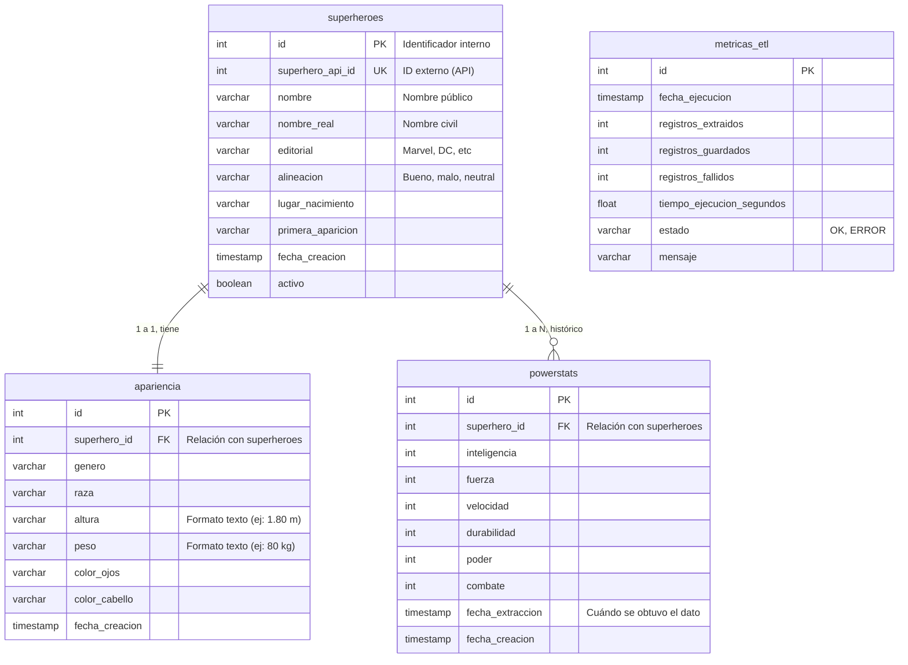

# 📊 Minería de Datos – Grupo 5

# 🚀 Clonar

Para clonar este proyecto desde Git:

```bash
git clone https://github.com/AsolanoT/Grupo5.Ramirez.Solano_MD1.git
```

---

# 👥 Autores – Grupo 5

**Jordan Ramírez Gallego**
📧 [jramirez-2023a@corhuila.edu.co](mailto:jramirez-2023a@corhuila.edu.co)

**Angel Gustavo Solano Trujillo**
📧 [agsolano-2023a@corhuila.edu.co](mailto:agsolano-2023a@corhuila.edu.co)

---

## 🦸 Proyecto ETL — SuperheroAPI

## Tabla de Contenidos

1. [Objetivo del Proyecto](#objetivo-del-proyecto)
1. [Descripción del Proyecto](#descripción-del-proyecto)
1. [Alcance](#alcance)

2. [API Fuente: SuperheroAPI](#api-fuente-superheroapi)
3. [Stack Tecnológico](#stack-tecnológico)
3. [Modelo de Base de Datos](#modelo-de-base-de-datos)
4. [Diagrama de Tablas (PlantUML)](#diagrama-de-tablas-plantuml)
5. [Estructura del Proyecto](#estructura-del-proyecto)
6. [Scripts del ETL](#scripts-del-etl)
   - [demo_data.py — Generador de Datos Sintéticos](#demo_datapy--generador-de-datos-sintéticos)
   - [transformador.py — Transformación de Datos](#transformadorpy--transformación-de-datos)
   - [extractor_db.py — Extracción y Carga (ETL)](#extractor_dbpy--extracción-y-carga-etl)
7. [Configuración (.env)](#configuración-env)

---

## Objetivo del Proyecto

Desarrollar una arquitectura de datos completa que permita:

* Extraer información desde una API externa.
* Transformar y estructurar datos para análisis.
* Diseñar una base de datos optimizada en PostgreSQL.
* Implementar visualizaciones interactivas.
* Aplicar modelos de machine learning para análisis predictivo.
* Presentar resultados con métricas de evaluación y recomendaciones.

---

## Descripción del Proyecto

Pipeline **ETL (Extract, Transform, Load)** que consume la [SuperheroAPI](https://superheroapi.com/) para extraer información de superhéroes (poderes, apariencia y biografía) y almacenarla de forma normalizada en una base de datos **PostgreSQL**.

El proyecto incluye:
- Extracción automática de datos reales desde la API.
- Generación de datos sintéticos para pruebas y demostraciones.
- Transformación y categorización de métricas de los héroes.
- Registro de métricas del proceso ETL para trazabilidad.

---
## Alcance

El proyecto incluye:

* Implementación de un extractor ETL con manejo de errores y logging.
* Almacenamiento estructurado en PostgreSQL.
* Dashboard interactivo en Streamlit.
* Análisis exploratorio de datos.
* Modelos de machine learning para:

  * Clasificación de superhéroes por nivel de fortaleza.
  * Predicción de valores faltantes.
  * Agrupamiento por afiliación.

No incluye entrenamiento en tiempo real ni integración con APIs privadas.

---

## API Fuente: SuperheroAPI

| Campo | Detalle |
|---|---|
| **URL base** | `https://superheroapi.com/api/{API_KEY}` |
| **Autenticación** | API Key en la URL |
| **Formato** | JSON |
| **Documentación** | [superheroapi.com](https://superheroapi.com/) |

### Endpoints utilizados

| Endpoint | Descripción |
|---|---|
| `/{hero_id}` | Datos generales del héroe |
| `/{hero_id}/biography` | Nombre real, editorial, alineación, lugar de nacimiento |
| `/{hero_id}/powerstats` | Inteligencia, fuerza, velocidad, durabilidad, poder, combate |
| `/{hero_id}/appearance` | Género, raza, altura, peso, color de ojos, color de cabello |

### Ejemplo de respuesta — `/powerstats`

```json
{
  "response": "success",
  "id": "644",
  "name": "Spider-Man",
  "powerstats": {
    "intelligence": "90",
    "strength": "55",
    "speed": "67",
    "durability": "75",
    "power": "74",
    "combat": "85"
  }
}
```
---
## Stack Tecnológico

| Componente | Tecnología |
|---|---|
| Lenguaje | Python 3.10+ |
| Base de datos | PostgreSQL 15 |
| ORM | SQLAlchemy + Alembic |
| HTTP Client | `requests` |
| Análisis | `pandas`, `numpy` |
| Configuración | `python-dotenv` |
| Entorno | WSL – Entorno Linux en Windows |
| Dashboard | Streamlit – Dashboard interactivo |
| Machine Learning | Scikit-Learn – Modelos de machine learning |
| Visualización | Matplotlib / Seaborn / Plotly – Gráficos interactivos |
| Notebooks | Jupyter – Análisis exploratorio |

---

## Modelo de Base de Datos

La base de datos `superheroes_etl` contiene cinco tablas:

### `superheroes` — Tabla principal

Almacena la información biográfica y de identidad de cada héroe.

| Columna | Tipo | Descripción |
|---|---|---|
| `id` | `integer` (PK) | Identificador interno |
| `superhero_api_id` | `integer` (UNIQUE) | ID oficial de la SuperheroAPI |
| `nombre` | `varchar(150)` | Nombre del superhéroe |
| `nombre_real` | `varchar(200)` | Nombre civil |
| `editorial` | `varchar(100)` | Marvel Comics / DC Comics |
| `alineacion` | `varchar(50)` | `good`, `bad`, `neutral` |
| `lugar_nacimiento` | `varchar(255)` | Lugar de origen |
| `primera_aparicion` | `varchar(200)` | Primera aparición en cómics |
| `fecha_creacion` | `timestamp` | Fecha de inserción |
| `activo` | `boolean` | Registro activo |

### `apariencia` — Características físicas

Relación 1:1 con `superheroes`. Se guarda de forma idempotente.

| Columna | Tipo | Descripción |
|---|---|---|
| `id` | `integer` (PK) | Identificador interno |
| `superhero_id` | `integer` (FK, UNIQUE) | Referencia a `superheroes.id` |
| `genero` | `varchar(50)` | Género del héroe |
| `raza` | `varchar(100)` | Raza o especie |
| `altura` | `varchar(50)` | Altura (ej: `"6'2" / 188 cm"`) |
| `peso` | `varchar(50)` | Peso (ej: `"810 lb / 368 kg"`) |
| `color_ojos` | `varchar(50)` | Color de ojos |
| `color_cabello` | `varchar(50)` | Color de cabello |
| `fecha_creacion` | `timestamp` | Fecha de inserción |

### `powerstats` — Estadísticas de poder (histórico)

Permite múltiples registros por héroe (serie de tiempo). Útil para rastrear cambios en los datos de la API a lo largo del tiempo.

| Columna | Tipo | Descripción |
|---|---|---|
| `id` | `integer` (PK) | Identificador interno |
| `superhero_id` | `integer` (FK) | Referencia a `superheroes.id` |
| `inteligencia` | `integer` | Stat de inteligencia (0-100) |
| `fuerza` | `integer` | Stat de fuerza (0-100) |
| `velocidad` | `integer` | Stat de velocidad (0-100) |
| `durabilidad` | `integer` | Stat de durabilidad (0-100) |
| `poder` | `integer` | Stat de poder (0-100) |
| `combate` | `integer` | Stat de combate (0-100) |
| `fecha_extraccion` | `timestamp` | Momento de extracción desde la API |
| `fecha_creacion` | `timestamp` | Fecha de inserción |

### `metricas_etl` — Auditoría del proceso ETL

Registra cada ejecución del pipeline para monitoreo y trazabilidad.

| Columna | Tipo | Descripción |
|---|---|---|
| `id` | `integer` (PK) | Identificador interno |
| `fecha_ejecucion` | `timestamp` | Inicio de la ejecución |
| `registros_extraidos` | `integer` | Héroes consultados a la API |
| `registros_guardados` | `integer` | Héroes insertados correctamente |
| `registros_fallidos` | `integer` | Registros con error |
| `tiempo_ejecucion_segundos` | `double` | Duración total del proceso |
| `estado` | `varchar(50)` | `SUCCESS`, `PARTIAL`, `FAILED` |
| `mensaje` | `varchar(500)` | Resumen textual del resultado |

---

## Diagrama de Tablas (PlantUML)



---

## Estructura del Proyecto

```
superheroes_etl/
│
├── scripts/
│   ├── database.py          # Configuración de conexión SQLAlchemy
│   ├── models.py            # Modelos ORM (Superhero, PowerStats, Apariencia, MetricasETL)
│   ├── extractor_db.py      # Pipeline ETL principal (consume la API)
│   ├── transformador.py     # Transformación y categorización de datos
│   └── demo_data.py         # Generador de datos sintéticos (sin API)
│
├── logs/
│   └── etl.log              # Log de ejecuciones del ETL
│
├── alembic/                 # Migraciones de base de datos
│   └── versions/
│
├── .env                     # Variables de entorno (no versionar)
├── alembic.ini
└── README.md
```

---

## Scripts del ETL

### `demo_data.py` — Generador de Datos Sintéticos

Genera superhéroes ficticios directamente en PostgreSQL **sin consumir la API**. Ideal para pruebas locales, desarrollo y demostraciones.

**Características:**
- Crea ~100 héroes ficticios inspirados en arquetipos de Marvel y DC.
- Genera estadísticas de poder con variación aleatoria usando `numpy`.
- Inserta registros de apariencia con datos físicos coherentes.
- Utiliza semilla fija (`seed=42`) para resultados reproducibles.
- Evita duplicados mediante validación previa por `superhero_api_id` ficticio.

**Ejecución:**
```bash
python scripts/demo_data.py
```

---

### `transformador.py` — Transformación de Datos

Lee los datos almacenados en PostgreSQL y aplica transformaciones analíticas.

**Transformaciones aplicadas:**

| Función | Descripción |
|---|---|
| `categorizar_poder_total()` | Clasifica héroes en `Bajo`, `Medio`, `Alto`, `Legendario` según suma de stats |
| `categorizar_alineacion()` | Mapea `good/bad/neutral` a etiquetas en español |
| `calcular_poder_total()` | Suma de los 6 powerstats como métrica compuesta |
| `limpiar_nulos()` | Reemplaza `None` en stats por `0` para cálculos seguros |

**Ejecución:**
```bash
python scripts/transformador.py
```

---

### `extractor_db.py` — Extracción y Carga (ETL)

Pipeline principal que consume la SuperheroAPI por ID y persiste los datos en PostgreSQL.

**Flujo del pipeline:**

```
IDs desde .env (HEROES)
        │
        ▼
  obtener_heroe(id)          ← GET /{id}
        │
        ├── obtener_endpoint(id, "biography")
        ├── obtener_endpoint(id, "powerstats")
        └── obtener_endpoint(id, "appearance")
                │
                ▼
         guardar_en_bd()
         ├── Upsert en superheroes
         ├── Insert en powerstats (histórico)
         └── Insert en apariencia (idempotente)
                │
                ▼
         guardar_metricas()  ← metricas_etl
```

**Estrategia de carga:**
- `superheroes`: **Upsert** — si el héroe ya existe por `superhero_api_id`, no se duplica.
- `powerstats`: **Append** — cada ejecución agrega una nueva fila (histórico).
- `apariencia`: **Idempotente** — solo se inserta si no existe registro previo para ese héroe.

**Ejecución:**
```bash
python scripts/extractor_db.py
```

---

## Configuración (.env)

```env
# ===========================
# PostgreSQL
# ===========================
DB_HOST=localhost
DB_PORT=5432
DB_USER=postgres
DB_PASSWORD=123456
DB_NAME=superheroes_etl

# ===========================
# SuperheroAPI
# ===========================
API_KEY=tu_api_key_aqui
# IDs oficiales de SuperheroAPI (separados por coma)
HEROES=644,70,332,720,149
```